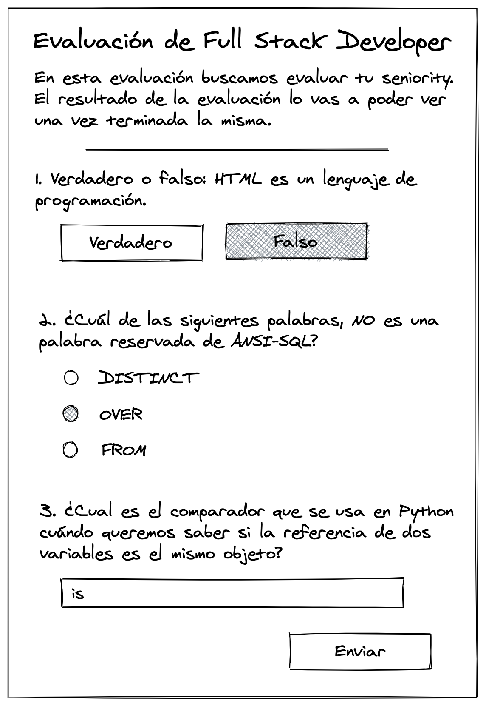

# Interview challenge: Examenes

## Objetivos

### Evaluar experiencia con React
En Trocafone utilizamos React para el eCommerce. Estamos migrando el site completo a React y la experiencia o la capacidad de aprendizaje en React es muy importante para nosotros. Nuestro code-base es grande y va a seguir creciendo, por lo tanto es requerido que sea mantenible y escalable.

> Buscamos entender cómo pensás los componentes y cómo manejás su diseño. También entender cómo preferís manejar el estado, las traducciones, llamadas a APIs, ruteo, etc.

> Buscamos entender cómo pensás los componentes y cómo manejás su diseño. También entender cómo preferís manejar el estado, las traducciones, llamadas a APIs, ruteo, etc.

## Problema

### Contexto
Se busca crear una web app para la toma de exámenes de forma online.

Un profesor, un recruiter o cualquiera que desee va a poder crear un examen en nuestra app y luego enviarlo mediante un link a otros usuarios para que lo contesten.

Buscamos crear una app responsive. Para este code challenge, nos vamos a enfocar en el usuario que contesta el examen y no el que la crea.

El primer paso es hacer un [MVP](https://en.wikipedia.org/wiki/Minimum_viable_product) y para esto definimos los siguientes requerimientos.

### Requerimientos
No es necesario un login, los exámenes que se completen van a ser anónimos.

Cuando un usuario entra al site, va a ver un listado de exámenes pendientes de contestar. La lista mostrará el nombre del examen y un botón para ir a contestar el examen.

El usuario va a poder elegir uno de esos exámenes para contestar, el cual lo va a llevar a la pantalla para completar el examen.

La pantalla para completar el examen va a mostrar todas las preguntas a realizar en una misma pantalla y abajo de todo va a tener un botón para enviar su examen. Cada examen debe poder soportar una cantidad ilimitada de preguntas. El orden de las preguntas lo da la API.

Cada pregunta debe pertenecer a uno de los siguientes tres tipos:

- **Multiple choice:**
Para este tipo de pregunta se cuenta con las opciones posibles.

- **Verdadero / Falso:**
Para este tipo de pregunta tenemos dos opciones “verdadero” o como “falso”

- **Texto libre:**
Para este tipo de pregunta el usuario va a poder ingresar en un campo de texto libre la respuesta que considere que es correcta.

Cuando un usuario termina de contestar un examen, la app debe mostrarle el puntaje que obtuvo; el cual está definido como la cantidad de preguntas correctas sobre el total de preguntas. Para esto, cada una de las preguntas va a tener una forma de corregirse.

El usuario no va a ver cual pregunta contestó bien o mal, sino que va a ver solamente el puntaje obtenido. Los exámenes ya contestados, no se mostrarán en el listado inicial.

## Se pide

### Definición de la interfaz de la API
Para las interacciones con el servidor:
1. Obtener la lista de exámenes para contestar
2. Comenzar resolución de un examen y obtener la definición del mismo
3. Envío y corrección de un examen

Crear un documento en el cual se defina:
- El endpoint a usar (definir el path y método HTTP, con los parámetros que pueda tener)
- Un ejemplo del body del request
- Un ejemplo del body de la respuesta en caso de éxito
- Ejemplos del body en caso de error.
- Códigos de respuesta HTTP

Para hacer esto, te pedimos que te bajes [Mockoon](https://mockoon.com/). Es una tool open source para crear mock APIs. Te deja definir diferentes respuestas para una API y te va a servir para testear el frontend.

Para exportar los datos [ver este tutorial.](https://mockoon.com/docs/latest/import-export-data/)

Para crear varias respuestas y elegir cual es la que devuelve la API [ver este tutorial.](https://mockoon.com/docs/latest/multiple-responses/)


Lo que no te deje definir en Mockoon (ejemplo: body del request), documentarlo en un archivo interfaz.md. Si no pudiste usar Mockoon, te pedimos que en ese archivo dejes definido todo lo que se pide en este punto.

### Implementación del frontend
Implementar el frontend en base a los requerimientos planteados y guiándose con el diseño que se puede encontrar aqui:

> 

Se puede utilizar tanto ES5/ES6 como Typescript para la implementación del code challenge.

> Se valora la escritura de tests que demuestren el correcto funcionamiento de la solución, sean unitarios y/o de integración.
>
> Tener en cuenta los casos de error de la API.


## Entrega
Te vamos a pedir que la entrega la hagas por mail en un `.zip` o `.tar.gz` con el código y una **versión compilada** con la siguiente estructura:

```
examen/
├── documents/
│   ├── interfaz.md
│   └── mockoon.json
├── code/
│   ├── ...
│   ├── src/
│   └── ...
├── dist/
│   ├── ...
│   ├── index.html
|   └── ...
└── README.md
```

En el `README.md` es importante agregar:
1. Cualquier consideración, aclaración o definición que se haya hecho sobre el enunciado debería estar escrita aquí, cuestión que podamos entender el por qué se tomó ciertas decisiones.
2. Explicar brevemente como se corre el código y si hay alguna consideración al correrlo.

> Seguramente el código sea pesado y no lo deje pasar por mail. Podés utilizar https://wetransfer.com/. También te recomendamos remover la carpeta `node_modules` antes de comprimir la carpeta.
